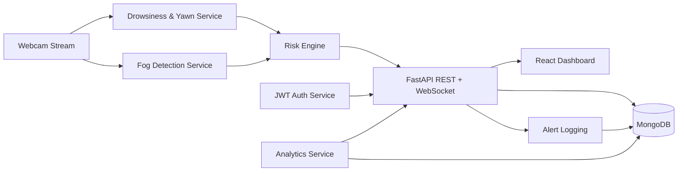

# Real-Time-Drowsiness-Detection-System

Drowsiness detection is a safety technology that can prevent accidents that are caused by drivers who fell asleep while driving. The objective of this project is to build a drowsiness detection system that will detect drowsiness through the implementation of computer vision system that automatically detects drowsiness in real-time from a live video stream and then alert the user with an alarm notification.

## Motivation 
According to the National Highway Traffic Safety Administration, every year about 100,000 police-reported crashes involve drowsy driving. These crashes result in more than 1,550 fatalities and 71,000 injuries. The real number may be much higher, however, as it is difficult to determine whether a driver was drowsy at the time of a crash. So, we tried to build a system, that detects whether a person is drowsy and alert him.

## Built With

* [OpenCV Library](https://opencv.org/) - Most used computer vision library. Highly efficient. Facilitates real-time image processing.
* [imutils library](https://github.com/jrosebr1/imutils) -  A collection of helper functions and utilities to make working with OpenCV easier.
* [Dlib library](http://dlib.net/) - Implementations of state-of-the-art CV and ML algorithms (including face recognition).
* [scikit-learn library](https://scikit-learn.org/stable/) - Machine learning in Python. Simple. Efficient. Beautiful, easy to use API.
* [Numpy](http://www.numpy.org/) - NumPy is the fundamental package for scientific computing with Python. 


# AI-Based Driver Safety Risk Prediction System

**Real-Time Drowsiness, Fog Detection and AI Risk Scoring Platform**

A production-focused academic project that combines computer vision, machine learning, secure APIs, real-time streaming, and analytics dashboards to monitor driver safety risk.

---

## Project Overview

This system detects risky driving conditions in real time using:
- **Drowsiness Detection** (EAR from facial landmarks)
- **Yawning Detection** (lip landmark opening distance)
- **Fog/Smog Detection** (EfficientNet-B0 image classifier)
- **Unified AI Risk Scoring Engine** (0–100 risk/safety transformation)

The platform includes:
- FastAPI backend with JWT authentication and MongoDB persistence
- React dashboard for live monitoring and analytics insights
- WebSocket streaming for real-time risk updates

---

## Architecture Diagram



---

## System Workflow

1. Webcam frames are processed continuously for drowsiness/yawn detection.
2. Fog model runs on uploaded images and periodic camera frames.
3. Risk engine computes a unified risk profile.
4. Alerts are generated for drowsiness, yawning, and fog conditions.
5. Events and predictions are stored in MongoDB collections.
6. Authenticated users consume analytics and alert history on the frontend.

---

## Machine Learning Models

### 1) Drowsiness & Yawning
- Library: MediaPipe Face Landmarker + OpenCV
- Feature: Eye Aspect Ratio (EAR)
- Output: drowsy/yawning boolean states, EAR score

### 2) Fog Detection
- Model: EfficientNet-B0 (PyTorch + timm)
- Weights: `backend/models/fog_model.pth`
- Output: `Clear` or `Fog/Smog` with confidence + fog probability

### 3) Accident Severity (existing module)
- Model: XGBoost-based predictor
- API endpoint: `/api/accident/predict`

---

## Tech Stack

### Backend
- FastAPI
- PyTorch, timm, OpenCV, MediaPipe
- MongoDB (PyMongo)
- JWT (PyJWT)
- bcrypt password hashing

### Frontend
- React + Vite
- React Router (with protected routes — login required for dashboard)
- Recharts for analytics visualization
- Auth pages: Login, Register, Forgot Password (multi-step OTP flow)

### Testing
- pytest
- FastAPI TestClient

---

## Database Collections

Implemented in `backend/database/mongo.py`:
- `users`
- `alerts`
- `fog_predictions`
- `drowsiness_events`
- `otp_requests`

### Example Documents

**User**
```json
{
  "id": "...",
  "name": "Aman",
  "email": "aman@example.com",
  "hashed_password": "...",
  "created_at": "2026-03-05T10:00:00Z"
}
```

**Alert**
```json
{
  "user_id": "123",
  "alert_type": "drowsiness",
  "timestamp": "2026-03-03T10:45:22Z",
  "severity": "high"
}
```

**Fog Prediction**
```json
{
  "image_name": "camera_frame.jpg",
  "fog_probability": 0.82,
  "timestamp": "2026-03-03T10:45:22Z"
}
```

**Drowsiness Event**
```json
{
  "ear_score": 0.19,
  "yawning_detected": true,
  "timestamp": "2026-03-03T10:45:22Z"
}
```

**OTP Request**
```json
{
  "email": "aman@example.com",
  "otp_code": "482917",
  "expiry_time": "2026-03-03T10:50:00Z",
  "created_at": "2026-03-03T10:45:00Z"
}
```

---

## API Summary

### Authentication
- `POST /auth/register`
- `POST /auth/login`
- `POST /auth/forgot-password`
- `POST /auth/verify-otp`
- `POST /auth/reset-password`

### Core APIs
- `GET /api/status`
- `GET /api/risk`
- `GET /api/drowsiness`
- `GET /api/fog` *(protected)*
- `POST /api/fog/upload` *(protected)*
- `POST /api/fog/predict-frame` *(protected)*

### Analytics & Alerts
- `GET /api/analytics/summary` *(protected)*
- `GET /api/alerts` *(protected)*
- `GET /api/drowsiness/logs` *(protected)*

### Accident Module
- `POST /api/accident/predict`
- `GET /api/accident/status`

---

## Example API Responses

### Login Response
```json
{
  "access_token": "<jwt_token>",
  "token_type": "bearer",
  "user": {
    "id": "507f1f77bcf86cd799439011",
    "name": "Aman",
    "email": "aman@example.com",
    "created_at": "2026-03-05T00:00:00+00:00"
  }
}
```

### Analytics Summary Response
```json
{
  "drowsiness_today": 5,
  "yawning_events": 3,
  "fog_alerts": 2,
  "safety_score": 72
}
```

### Forgot Password (dev mode — no SMTP configured)
```json
{
  "message": "OTP generated (SMTP not configured — dev mode)",
  "dev_otp": "482917"
}
```

### Structured Error Response
```json
{
  "error": "Invalid image format"
}
```

---

## Installation Guide

## 1) Clone Repository
```bash
git clone <your-repo-url>
cd DriverSafetySystem
```

## 2) Backend Setup
```bash
python -m venv .venv
source .venv/bin/activate
pip install -r requirements.txt
```

Create `.env` (recommended):
```env
HOST=0.0.0.0
PORT=8000
MONGO_URI=mongodb://localhost:27017
MONGO_DB_NAME=driver_safety
JWT_SECRET_KEY=change-this-secret
JWT_EXP_MINUTES=60
RATE_LIMIT_REQUESTS=120
RATE_LIMIT_WINDOW_SECONDS=60

# OTP (optional — leave blank for dev-mode console logging)
OTP_EXPIRY_MINUTES=5
SMTP_HOST=smtp.gmail.com
SMTP_PORT=587
SMTP_USER=your@gmail.com
SMTP_PASS=your-app-password
SMTP_FROM=noreply@driversafety.ai
```

## 3) Frontend Setup
```bash
cd frontend
npm install
npm run dev
```

---

## How to Run Backend

From project root:
```bash
python app.py
```

API docs:
- http://localhost:8000/docs

---

## How to Run Frontend

From `frontend/`:
```bash
npm run dev
```

Frontend URL:
- http://localhost:5173

---

## Security Features

- JWT-based authentication with expiration
- bcrypt password hashing
- OTP-based password reset (6-digit, 5-minute expiry, stored in MongoDB)
- Request rate limiting middleware
- Pydantic request validation
- CORS middleware enabled
- Structured error responses

---

## Test Suite

Run all tests:
```bash
pytest tests -v
```

New test modules:
- `tests/test_auth.py`
- `tests/test_fog_api.py`
- `tests/test_drowsiness_logic.py`
- `tests/test_analytics_api.py`

---

## Screenshots (Placeholders)

- `docs/screenshots/dashboard-overview.png`
- `docs/screenshots/live-risk-page.png`
- `docs/screenshots/analytics-page.png`
- `docs/screenshots/alert-history-page.png`

---

## Academic Notes

This project is designed for academic evaluation with emphasis on:
- AI model integration into full-stack systems
- production-ready backend practices
- secure API architecture
- interpretable risk analytics and reporting

---

## Credits

Developed by Aman Kushwah and Uday Kushwah.
>>>>>>> origin/Aman
